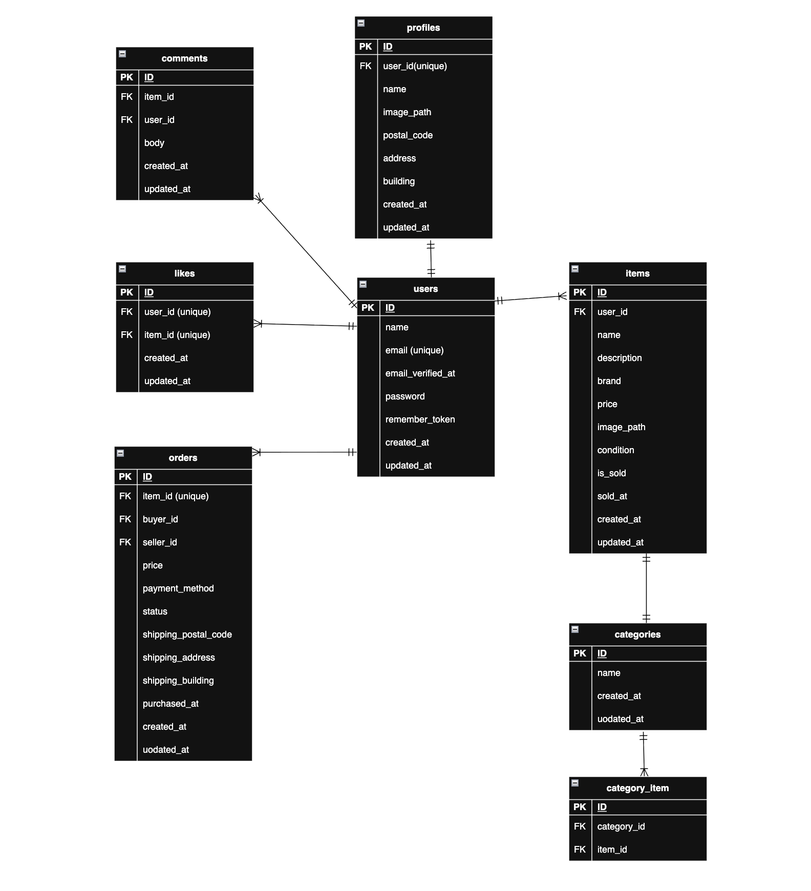

# 模擬案件　coachtechフリマ

## アプリ概要
ユーザーが商品を出品し、他のユーザーが商品を購入できるフリマサービスを想定しています。

ユーザー登録・ログイン・商品出品・商品購入・コメント・いいね機能など、  
フリマアプリの基本機能をLaravelで実装しています。

また、実際のサービスに近づけるために以下の機能も実装しています。

- Stripeを利用した決済機能
- MailHogを利用したメール認証機能
- PHPUnitによる自動テスト
---

## 環境構築

### Dockerビルド
- git clone git@github.com:hirokinoppa/coachtech-flea-market.git
- cd coachtech-flea-market
- docker-compose up -d --build

---

### Laravel環境構築
- docker compose exec php bash
- composer install
- cp .env.example .env
- php artisan key:generate
- php artisan migrate
- php artisan db:seed

---

## Stripe設定

StripeのAPIキーを取得して `.env` に設定してください。

.env
- STRIPE_KEY=your_stripe_public_key
- STRIPE_SECRET=your_stripe_secret_key

Stripeテストキーは以下から取得できます。
- https://dashboard.stripe.com/test/apikeys

## 開発環境
- トップページ：http://localhost/
- ユーザー登録：http://localhost/register
- ログイン：http://localhost/login
- phpMyAdmin：http://localhost:8080/
- MailHog(メール認証):http://localhost:8025/

---

## 主な機能
認証機能
- ユーザー登録
- ログイン / ログアウト
- メール認証（MailHog）
- 認証メール再送機能

新規登録後、メール認証を完了することでサービスを利用できます。

商品機能
- 商品一覧表示
- 商品詳細表示
- 商品検索
- 商品出品
- コメント機能
- いいね機能

マイページ機能
- 出品商品一覧表示
- 購入商品一覧表示
- プロフィール編集

購入機能

支払い方法選択

以下の支払い方法を選択できます。
- コンビニ支払い
- カード支払い

決済処理

Stripe Checkout を利用して決済を行います。

購入ボタンを押すとStripeの決済画面に遷移し、決済完了後に購入処理が実行されます。

## 使用技術（実行環境）
- PHP 8.2.11
- Laravel 8.83.8
- MySQL 8.0.34
- nginx 1.21.1
- Docker
- Laravel Fortify（認証機能）
- Stripe（決済機能）
- MailHog（メール送信確認）

---

## テーブル設計
- users（ユーザー）
- profiles（プロフィール）
- items（商品）
- categories（カテゴリー）
- category_item（商品カテゴリー中間テーブル）
- comments（コメント）
- likes（いいね）
- orders（注文）

---

## テスト
 PHPUnitを使用して機能テストを実装しています。
### テスト実行
- php artisan test
## 主なテスト
- ユーザー登録
- ログイン
- 商品出品
- 商品検索
- 商品詳細表示
- コメント機能
- いいね機能
- マイページ表示
- プロフィール更新
- 商品購入
- 支払い方法選択
- 配送先変更

---

## ER図

本アプリケーションのテーブル構造です。
ユーザーを中心に商品・注文・コメント・いいねなどの関係を設計しています。

---

